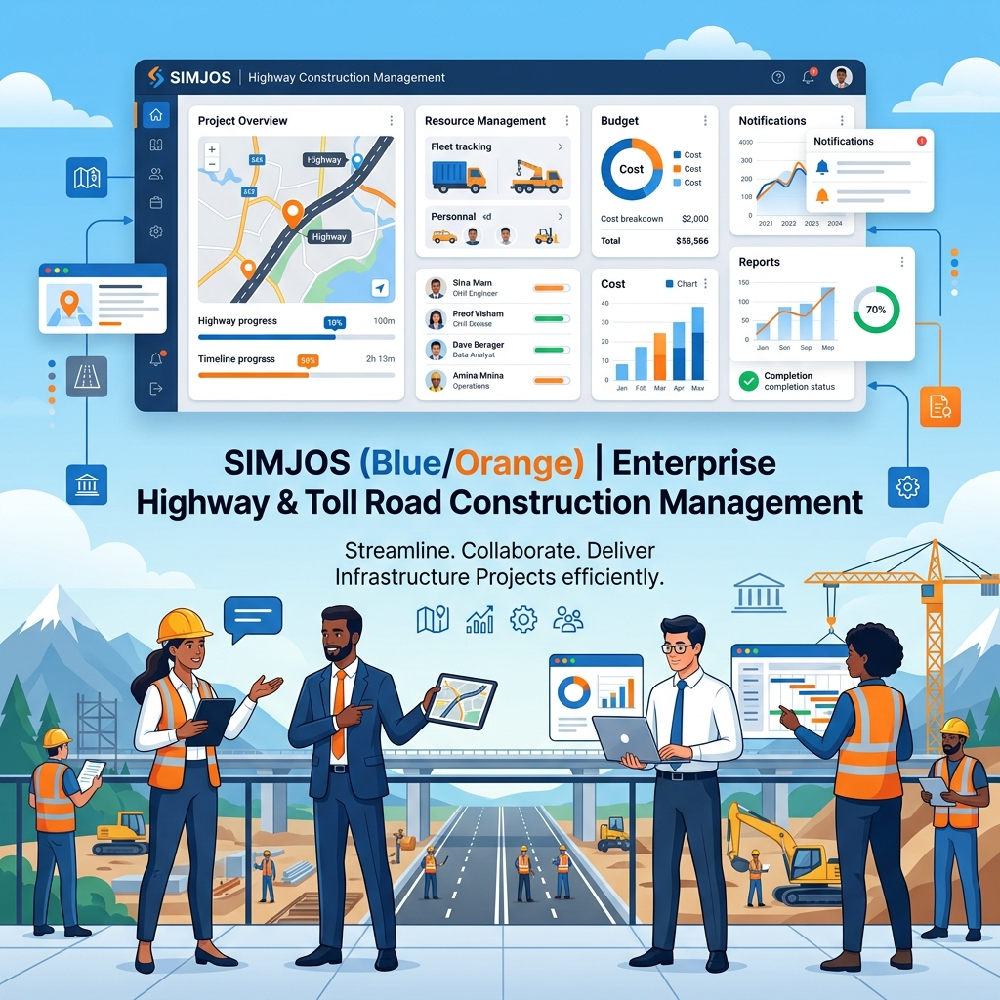

<div align="center">
  
</div>

# 🛣️ SIMJOS - Sistem Informasi Manajemen Jalan Tol

<div align="center">
  
[](https://www.php.net/)
[](https://www.postgresql.org/)
[](https://codeigniter.com/)

**SIMJOS** hadir untuk memberdayakan tim Anda dalam mengelola setiap fase kehidupan proyek jalan tol. 
Mulai dari pembebasan lahan, pengelolaan kontrak, hingga audit akhir—semuanya dalam satu platform yang humanis, terpusat, dan mudah digunakan.

*Seluruh antarmuka (frontend) dan perancangan sistem desain (design system) modern dalam aplikasi ini dibangun dan dikembangkan sepenuhnya oleh saya.*

</div>

---

## 🌟 Mengapa Memilih SIMJOS?

Kami memahami bahwa di balik setiap proyek infrastruktur berskala besar, terdapat tim dan individu yang bekerja keras setiap harinya. **SIMJOS** didesain tidak hanya sekadar sebagai mesin pencatat data, melainkan sebagai asisten kolaboratif yang:

*   **🤝 Meringankan Beban Administratif**: Biarkan sistem yang menangani pengarsipan kontrak dan dokumen yang rumit, sehingga tim Anda dapat fokus pada pengambilan keputusan strategis.
*   **👁️ Memberikan Visibilitas Penuh**: Melalui *dashboard* interaktif, manajer dan eksekutif dapat memantau kesehatan proyek, serapan anggaran, dan progres fisik kapan saja tanpa perlu menyusun laporan manual berjam-jam.
*   **🛡️ Memberikan Rasa Aman**: Dengan rekam jejak audit (audit trail) dan pengelolaan standar kepatuhan (ISO), SIMJOS membantu tim Anda meminimalisir risiko teguran dan menjaga transparansi penuh di mata publik dan auditor.

---

## 🚀 Fitur Unggulan untuk Tim Anda

*   **📊 Dashboard Eksekutif**: Tampilan visual yang intuitif, menyajikan ringkasan progres fisik, serapan anggaran, dan metrik penting lainnya dalam satu kedipan mata.
*   **📑 Manajemen Kontrak Kolaboratif**: Pantau seluruh kontrak konstruksi, jasa konsultan, hingga detail adendum tanpa khawatir ada dokumen yang tercecer.
*   **💼 Keuangan & Pembebasan Lahan**: Kelola pencatatan Dana Talangan Tanah (DTT) dan Equity dengan lebih rapi, menghindari miskalkulasi yang merugikan.
*   **📁 Arsip Digital Pintar**: Tak ada lagi tumpukan kertas. Temukan kembali SOP, Peraturan, dan Master Dokumen dengan pencarian yang cepat dan relasi data yang jelas.
*   **🛣️ Pantauan Lapangan *Real-Time***: Evaluasi dan pantau kemajuan fisik pembangunan proyek tol serta fase operasional pasca-konstruksi secara terstruktur.
*   **🛡️ Kepatuhan & Keamanan (Audit ISO)**: Pantau temuan audit K3, mutu, dan lingkungan untuk memastikan tempat kerja yang lebih aman dan proyek yang ramah lingkungan.

---

## 📸 Tampilan Layar (Screenshots)

Berikut adalah beberapa cuplikan antarmuka dari aplikasi SIMJOS yang dirancang agar modern dan mudah digunakan:

### Halaman Login


### Dashboard Eksekutif


### Tabel Data


### Form Input


---

## 🎨 Kontribusi Frontend & Sistem Desain (Design System)

Sebagai pengembang frontend pada proyek ini, saya merancang antarmuka **SIMJOS** dengan pendekatan *user-centered design* untuk menjamin kemudahan navigasi (*usability*) serta estetika visual yang premium.

### Sistem Desain (Design System)
SIMJOS mengusung sebuah sistem desain terstruktur guna memastikan konsistensi visual di seluruh modul aplikasi:
*   **🎨 HSL Tailored Palette**: 
    *   **Warna Utama (Primary)**: Slate / Navy Blue untuk memberikan kesan profesional, tepercaya, dan berstandar *enterprise*.
    *   **Warna Aksen**: Warna oranye hangat (*warm orange*) dan kuning keemasan yang terinspirasi dari marka serta elemen visual jalan tol untuk menyoroti navigasi aktif dan status penting.
    *   **Warna Semantik**: Merah (keterlambatan/bahaya), Hijau (selesai/operasi), Jingga (persiapan/konstruksi) untuk mempermudah pemindaian status data secara instan.
*   **✍️ Tipografi & Hirarki**: Menggunakan font modern sans-serif yang bersih dengan hirarki ukuran yang tegas, memastikan laporan angka dan data teknis jalan tol sangat mudah dibaca.
*   **🧱 Komponen Visual Konsisten**: Kartu ringkasan (*dashboard cards*), tabel data interaktif (*Datatables*), tombol aksi, dan formulir input dirancang seragam demi pengalaman navigasi yang intuitif.
*   **📱 Responsivitas Penuh**: Tata letak fleksibel didesain agar adaptif untuk diakses nyaman oleh manajemen di kantor pusat (desktop) maupun pengawas lapangan (tablet/smartphone).

---

## 🛠️ Teknologi yang Memberdayakan

Di balik antarmuka yang bersahabat, SIMJOS ditopang oleh teknologi enterprise yang solid dan *reliable*:

*   **Core Logic**: PHP `^7.4` dengan **CodeIgniter 3** (Arsitektur MVC yang cepat dan stabil).
*   **Data Center**: **PostgreSQL** (Integritas data tingkat tinggi untuk transaksi finansial dan arsip).
*   **Pengalaman Pengguna (UX)**: Integrasi cerdas antara `DataTables`, `jQuery`, dan komponen visual yang responsif agar tim dapat bekerja nyaman dari berbagai perangkat.

---

## 📁 Struktur Ruang Kerja (Bagi Developer)

Struktur aplikasi diorganisir dengan rapi mengikuti standar *best practice*, sehingga memudahkan *developer* baru untuk langsung bergabung dan berkontribusi secara efisien:

```text
simjos/
├── application/
│   ├── config/             # Pusat pengaturan saraf aplikasi
│   ├── controllers/        # Pengatur alur kerja & logika bisnis
│   ├── models/             # Pusat interaksi dengan database
│   └── views/              # Desain antarmuka pengguna
├── assets/                 # Gaya visual, gambar, dan elemen interaktif
├── backup_db/              # Titik aman restorasi data
└── index.php               # Gerbang utama aplikasi
```

---

## 🔒 Lisensi

Project ini dilindungi di bawah lisensi internal / proprietary. Detail penggunaan dapat dibaca lebih lanjut di file `license.txt`.

---

> [!NOTE]
> **SIMJOS** didedikasikan bagi setiap insinyur, analis, dan manajer yang bermimpi menghubungkan bangsa melalui infrastruktur berkualitas. Bersama SIMJOS, kita kelola hari ini untuk perjalanan esok yang lebih baik.
